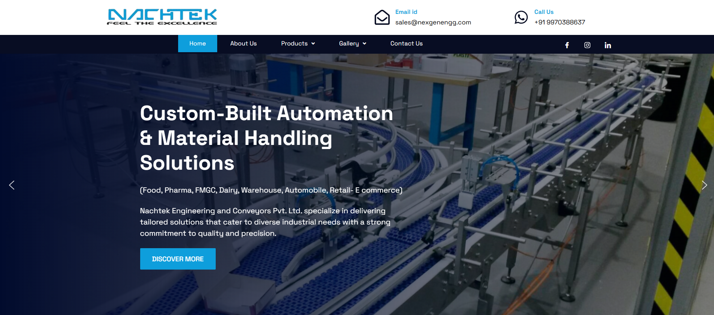

# Nexgen

**Client:** Nexgen  
**Industry:** Technology & Innovation  
**Technology Stack:** PHP, MySQL, WordPress, WooCommerce, Elementor, Astra Theme  
**Website:** [https://nexgen.smarttesting.in](https://nexgen.smarttesting.in)

---

### 📝 Overview

Nexgen, a progressive organization dedicated to providing innovative and trustworthy products, approached us with the need for a clean, professional, and highly functional website. The objective was to showcase their brand's vision while ensuring a smooth user experience and scalability for future growth.

---
### 🎯 Objectives

- Create a visually appealing business website aligned with Nexgen's innovation-led strategy.
- Provide seamless product presentation with WooCommerce integration.
- Deliver a responsive, mobile-friendly, and fast-loading interface.
- Enable simple backend management for the client.

---
### ⚠️ Challenges

The primary challenge was crafting a contemporary, intuitive design that would help Nexgen stand out in a competitive market—without becoming cluttered or amateurish. Striking the right balance between visual appeal and functionality was critical.

---
### 💡 Solution

We followed a strategic approach to design and development:

- **WordPress CMS**: Chosen for its flexibility and ease of content management.
- **Astra Theme**: Selected for speed, lightweight framework, and compatibility with major page builders.
- **Elementor**: Enabled creation of custom, responsive layouts with precision.
- **WooCommerce**: Integrated to support future eCommerce needs.
- Custom icons, tailored color palette, and neatly structured content blocks were implemented to enhance user engagement.

---
### 🚀 Major Features

- ✨ Polished homepage showcasing Nexgen's core offerings and values  
- 📄 Service pages clearly explaining each solution  
- ✉️ Contact form for inquiries and communication  
- ⚡ Optimized images and caching for faster load times  
- 📱 Fully responsive across all devices  
- 🏗️ Scalable architecture to support future development  

---
### ✅ Results

- **Improved Online Presence**: A modern and innovative website reflecting Nexgen's brand.
- **Intuitive User Interface**: Easy-to-use design that enhances user engagement.
- **Client Satisfaction**: Nexgen appreciated the seamless blend of aesthetics and functionality, along with the ease of managing the backend.

---
### 💬 Client Testimonial

> “The website truly captures our brand. The design is clean, and the backend is easy to manage. We’re excited to showcase this to our clients and partners.”

